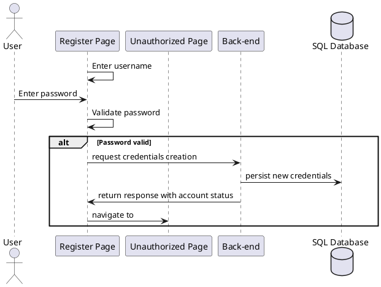

<u>Objectives</u>: Depict the flow of data when a user registers a new account

- New users are given the "new" account status
- When they create an account or log in with an "new" account, the application navigates to the unauthorized page
