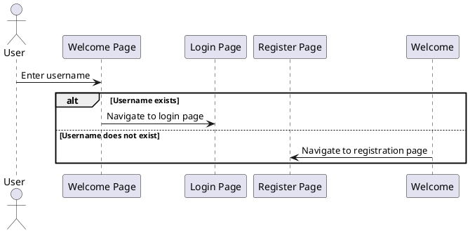

<u>Objectives</u>: Depict the flow of data when a user interacts with the welcome screen `welcome.page.html`

```plantuml
@startuml
actor User
participant "Welcome Page" as welcome
participant "Login Page" as login
participant "Register Page" as register

User -> welcome : Enter username

alt Username exists
    welcome -> login : Navigate to login page
else Username does not exist
    Welcome -> register : Navigate to registration page
end

@enduml
```
- If the user exists, auto fill in the username part of the log in page